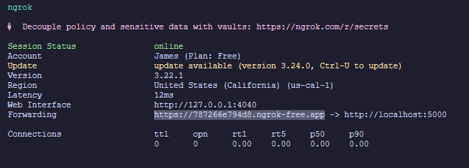
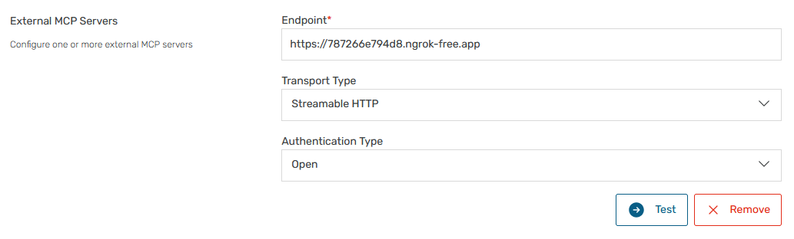

# Cardiovascular Disease MCP

An open source repository containing a CVD risk model predictor and an external MCP server for use in Darena Health (MeldRx)

## CVD Risk Model

Utilizes the risk model from Oracle Health's [ascvd-risk-calculator](https://github.com/cerner/ascvd-risk-calculator/tree/master) which is based off of the Pooled Cohort Equations and lifetime risk prediction tools. This calculator follows the [2013 ACC/AHA Guideline on the Treatment of Blood Cholesterol to Reduce Atherosclerotic Cardiovascular Risk in Adults](http://circ.ahajournals.org/content/circulationaha/129/25_suppl_2/S1.full.pdf).

This tool is intended for those with an assumed LDL - Cholesterol < 190 mg/dL, and
the following are a number of factors required to calculate an estimated ASCVD risk:

- Sex
- Age
- Race
- Total Cholesterol
- HDL - Cholesterol
- Systolic Blood Pressure
- Diabetes status
- Current Smoking status
- Treatment for Hypertension status

The risk scores calculated by this tool and
any recommendations provided are intended to inform, and should not supersede any findings or opinions by a care provider.

The file associated with the model calculation is located in [mcp-tools/calculate-cvd-risk-tool](/mcp-tools/calculate-cvd-risk-tool)

### 10-year ASCVD Risk

The 10-year risk estimate provided by this application is primarily applicable towards African-American and non-Hispanic white men and women between the ages of 40 and 79 years. Other ethnic groups will have their score calculated with the same equation for non-Hispanic white men and women, though the score estimated may underestimate or overestimate the risk for these persons.

## MCP server

This custom MCP server is based off of [Darena Health's default Community MCP Repository](https://github.com/darena-solutions/darena-health-community-mcp)

### File structure

- MCP tools (context functions for LLM): [/mcp-tools](/mcp-tools)
- FHIR server wrapper for context: [fhir-utilities.ts](./fhir-utilities.ts)

### Running Locally

1. Install [NPM][1] and install/update [Node][2]
2. Run `npm install` to install all dependencies onto the project
3. Run `npm start` to start the server on **port 5000** of localhost

<details>
<summary>Running on Docker</summary>

### Running on Docker

1. Install and open [Docker Desktop][5]
2. In terminal, run this to create a docker image and run the container

   ```bash
   docker-compose up --build
   ```

</details>

### Creating a web-facing API endpoint

For local development, use ngrok for creating a quick endpoint for your local MCP server.

1. Install [ngrok][3] and create an auth token by making an account
2. In your terminal, run `ngrok http 5000`
3. Copy the ngrok forwarded URL (highlighted below)

   
4. In MeldRx, navigate to your `workspace -> AI -> MCP Servers` and click `Add External MCP Server`
5. Input the fields as outlined below and click `Test` and `Save`

   

[1]: https://github.com/npm/npm#super-easy-install
[2]: https://nodejs.org/en/download/
[3]: https://download.ngrok.com/
[4]: https://code.visualstudio.com/Download
[5]: https://www.docker.com/products/docker-desktop/
